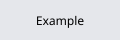

## platform-feature-01-risk-01

### Title

Synthetic contract risk

### Description

Synthetic risk used to verify the parser contract. (MITRE ATT&CK: ***Discovery*** - TA0032).

### Demonstration

#### 01. Observe the synthetic finding

Run the synthetic check and read its output.

``` shell
example --check
```



*Synthetic screenshot for the contract fixture.*

Feature-01-Risk-01 control measures:

- [platform-feature-01-risk-01-control-01](platform-feature-01-risk-01-control-01.md)

### References

- [platform-feature-01-risk-01-control-01](platform-feature-01-risk-01-control-01.md)
